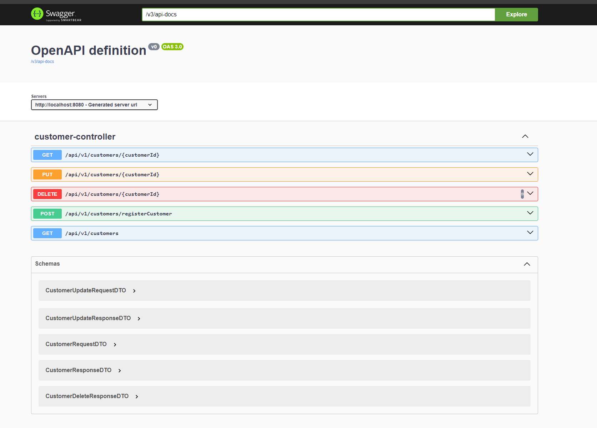

# Banking Microservices Project

This project implements a banking system using microservices architecture with Spring Boot. It consists of two main services: Customer Management and Account Management, along with supporting infrastructure components.

## Architecture Overview

### High Level Design

### Components
- Eureka Server: Service discovery
- Spring API Gateway: Central entry point for all requests
- Customer Service: Manages customer information
- Account Service: Manages customer accounts
- Feign Client: For inter-service communication

## Services

### Customer Service

Responsible for managing customer information.

- Customer attributes:
    - Name
    - Legal ID (7 digits)
    - Type (retail, corporate, investment)
    - Address
    - Other relevant information

### Account Service

Manages customer accounts.

- Account attributes:
    - Account number (10 digits, starts with customer ID)
    - Balance
    - Account status
    - Account type (salary, savings, investment)

## Database

- Each service (Customer and Account) has its own PostgreSQL database
- Flyway is used for database migration and version control

## API Specifications

- RESTful APIs following the Open API Specification standard
- Proper request/response validation

## Validation Rules

- Customer ID: 7 digits
- Account number: 10 digits (first 7 digits are the customer ID)
- Maximum 10 accounts per customer
- Account types:
    - One salary account allowed per customer
    - Multiple savings or investment accounts allowed

## Project Structure
BankManagementSystem/
├── eureka-server/
├── api-gateway/
├── customer/
│   ├── src/
│   │   ├── main/
│   │   │   ├── java/
│   │   │   └── resources/
│   │   │       └── db/migration/
│   └── pom.xml
├── account/
│   ├── src/
│   │   ├── main/
│   │   │   ├── java/
│   │   │   └── resources/
│   │   │       └── db/migration/
│   └── pom.xml
└── pom.xml

## Setup and Running

1. Start the Eureka Server
2. Start the API Gateway
3. Start the Customer Service
4. Start the Account Service

Ensure that PostgreSQL is running and the necessary databases (customer , account) are created before starting the services.

### Postman Collection
you can find the postman collection in the root directory of the project. under the name `BankManagementSystem.postman_collection.json`

## Technologies Used

- Spring Boot
- Spring Cloud Netflix (Eureka)
- Spring Cloud Gateway
- Feign Client
- PostgreSQL
- Flyway
- OpenAPI (for API documentation)
- Apache Maven
- Apache Kafka
- Docker
- Micrometer
- Zipkin
- Lombok

### Screenshots from the application

#### sonarqube report

#### OpenApi and Swagger UI

#### Zipkin

#### Eureka Server

#### Kafka

## Development

- Follow proper code structure and best practices for Spring Boot applications
- Use Flyway for database migrations
- Implement comprehensive validation for API requests/responses and database operations
- Ensure proper error handling and logging

## Testing

both account and customer service have been fully unit tested with over 80% code coverage.
both account and customer controller have been tested with integration tests.

## Deployment
all services contain docker files to build an image and deploy the service in a container.
the docker-compose file is also provided to deploy all services in a single command as of now the docker compose file contains
the kafka , zookeeper , postgresql and zipkin images.